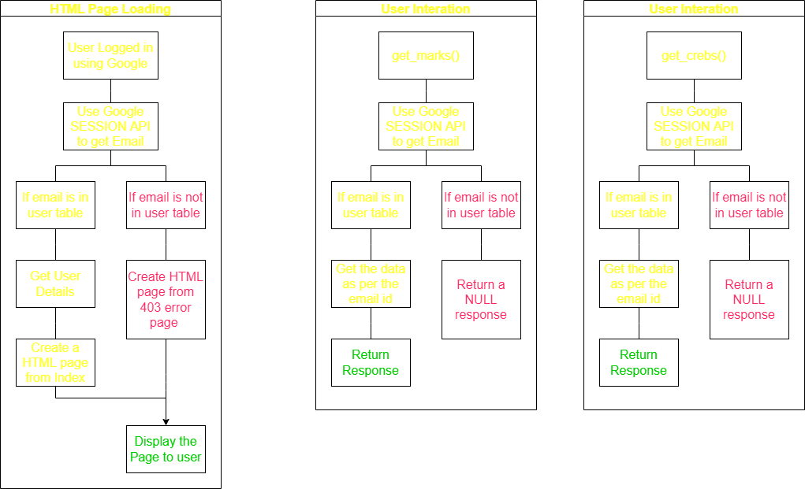

# Show My Grade


[](https://choosealicense.com/licenses/mit/)

In this project we are developing a full phase `frontend + backend` web-app for student to check their marks in a course using [Google Apps Script](https://developers.google.com/apps-script).

## Authors

- [@rjanain](https://www.github.com/rjanain)

## Frontend

For frontend, we make an `webapp` by using `standalone` Apps Script that return an `HtmlService`. It required google authentication to access the service. Once user logged in using google account, it check whether the email mentioned in the user database. If not then it display `403.html` error page, otherwise user can access the `index.html` page. As we need to see the email id who is accessing the app, the web app have to be deployed with following permission.

- **Execute As**: Execute the app as user accessing the web app
- **Who has Access to this App:** Anyone with a google account.

### Index.html

After validating the user it generate `index.html` page which have following information.

- _Home Page:_ User basic information like email, name, roll, tutorial, etc. will present in this page. Homepage also present some notices, solution to question paper, etc.
- _Performance Page:_ By using this page student can check their marks. It fetch that particular student data from mark database and show it as a table. Note that if the user is admin then all students mark will appear on the table.
- _Response Page:_ By using this page user can check the grader response against their crib. A student can only check response against his/her own crib but an admin can see all crib's response.

### Frontend Workflow



## Backend

We will use JSON object of the form `Array of Objects` as our database, like

```JSON
[{},{},{}]
```

### Database Table Schema

We have to maintian three tables, `Mark`, `User`, `Crib`.

- In `Mark database`, every object must have to contain a key `roll` with a non null value. For each exam we follow the following convention for keys.

  - `ei_obj`: Marks obtained in objective part of ith Exam.
  - `ei_sub`: Marks obtained in subjective part of ith Exam.
  - `ei`: Total marks obtained in the ith Exam. This is basically `ei_obj+ei_sub`.

- In `User database`, every object must have to contain a key `email` with a valid email id. It is important because we use this to provide access to user. For other fields we follow the following convention for keys.

  - `id`: For student, the `id` is their roll number but for `admin` we have to assign some unique value to each admin. This have to be non-null value.
  - `name`: Name of the User
  - `type`: Type of the user: `stud/admin/ta`.
  - `tut`: Tutorial group of the user, for `admin` it can be empty.
  - `div`: Division of the user, for `admin` it can be empty.

- In `Crib database`, every object must have to contain a key `email` with a valid email id. For other fields we follow the following convention for keys.
  - `roll`: Roll number of the student who submitted the crib.
  - `timestamp`: When user submit the Crib.
  - `exam_no`: Exam for which crib was submitted.
  - `q_no`: Question number against which crib was submitted.
  - `crib_type`: The type of crib: `data missing`, `counting error`, `ungraded answer`, `wrong grading`, `rechack request`
  - `crib`: A detailed feedback why he submit the crib.
  - `resolve_type`: `No Change/Updated/Rejected`
  - `response`: A detailed response from the grader.
  - `change`: How much mark increased/ decreased. Use `+` or `-` before the number to indicate the change.

### Backend Workflow


